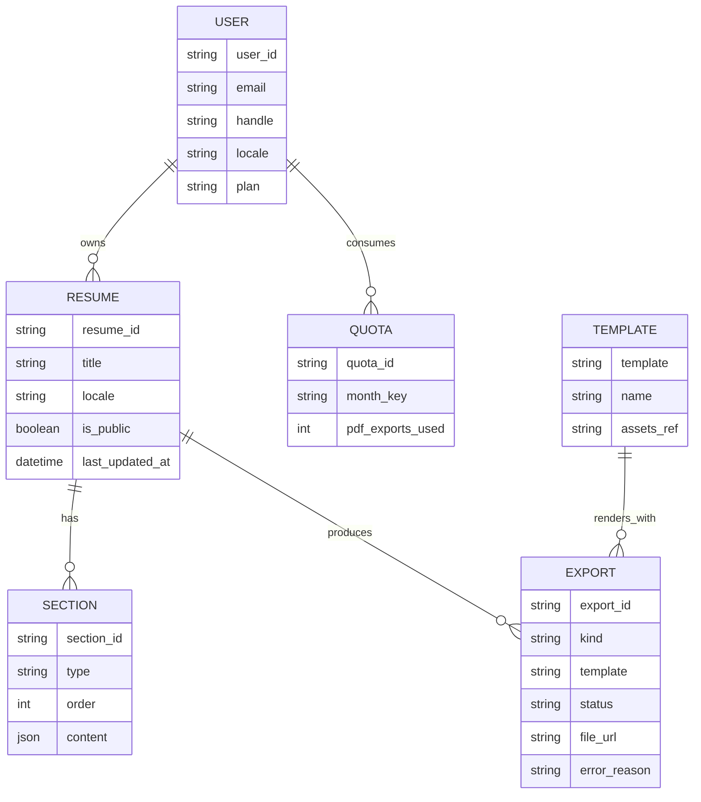

# Conceptual Model (MVP)

> 목적: 도메인 개체와 **비즈니스 의미가 있는 핵심 속성**, 관계를 정의한다.
> 감사/시스템 필드(`created_at`, `updated_at` 등)는 **논리/물리 모델링 단계에서 전 테이블 공통으로** 추가한다.
> 식별자 네이밍: **`[entity]_id`** (예: `user_id`, `resume_id`)

---

## Scope

대상 엔티티: **User, Resume, Section, Export, Quota, Template(옵션)**

---

## Entities (Key Attributes Only)

### User

- `user_id` : 사용자 식별자
- `email` : 로그인/알림용 (고유)
- `handle` : 공개 URL용 별칭 (고유, URL-safe)
- `locale` : 기본 언어 (예: `en-US`, `ko-KR`)
- `plan` : 요금제 (초기 `free`)

> *Note:* `created_at` 등 감사 컬럼은 개념 모델에서는 생략(물리 모델에서 공통 적용)

### Resume

- `resume_id` : 이력서 식별자
- `title` : 제목
- `locale` : 렌더링 언어 (예: `en-US`, `ko-KR`)
- `is_public` : 공개 여부
- `last_updated_at` : **도메인적으로 의미 있는 최근 수정 시각**
  > 물리 스키마에서는 공통 `updated_at`이 이 역할을 겸함

### Section

- `section_id` : 섹션 식별자
- `type` : `basic_info|summary|work|projects|skills|links` *(MVP 기준)*
- `order` : 사용자 정의 노출 순서 (정수)
- `content` : 섹션 타입별 도메인 데이터 컨테이너(아래 참조)

> 각 이력서는 섹션을 자유롭게 추가/수정/삭제 및 재정렬할 수 있다. `type`별 최소 스키마는 아래 규칙을 만족해야 한다.

#### Canonical Content (MVP Scope)

- **basic_info** *(단일 객체)*
  - `name` (필수)
  - `job_title` (필수)
  - `email` (필수)
  - `phone` (선택)
  - `location` (선택)
  - `profile_image_url` (선택)

- **summary** *(단일 객체)*
  - `text` (필수, 2~4문장 권장)

- **work** *(다중 항목)*
  - `items[]`
    - `company` (필수)
    - `title` (필수)
    - `period` { `start` (필수), `end` (선택) }
    - `employment_type` (선택)
    - `highlights[]` (선택)
    - `tech_stack[]` (선택)

- **projects** *(다중 항목)*
  - `items[]`
    - `name` (필수)
    - `role` (필수)
    - `period` { `start` (필수), `end` (선택) }
    - `summary` (필수)
    - `results[]` (선택)
    - `links[]` { `label`, `url` } (선택)

- **skills** *(다중 항목)*
  - `keywords[]` (필수)
  - `proficiencies[]` (선택, 숙련도 그룹이 필요한 경우)

- **links** *(다중 항목)*
  - `items[]`
    - `label` (필수)
    - `url` (필수)

#### Future Types (Out of Scope for MVP)

- **education**: `items[]` { `institution`, `degree`, `major`, `period`{ `start`, `end` }, `type`, `status` }
- **certificates_awards**: `items[]` { `name`, `score_or_level`, `obtained_at`, `issuing_organization`, `description?` }
- **languages**: `items[]` { `name`, `level`, `exams[]`{ `name`, `score_or_level`, `obtained_at` } }
- **portfolio**: { `links[]`{ `url`, `description` }, `attachments[]`{ `file_key`, `filename`, `content_type`, `file_size`, `uploaded_at` } }

### Export

- `export_id` : 내보내기 식별자
- `kind` : `pdf|html`
- `template` : 렌더링에 사용된 템플릿 키
- `status` : `pending|processing|succeeded|failed`
- `file_url` : 결과 파일 참조
- `error_reason` : 실패 사유(선택)
  > 템플릿을 지정하지 않은 경우 시스템 기본 템플릿을 사용한다.

### Quota (월간 사용량)

- `quota_id` : 월간 사용량 식별자
- `month_key` : `YYYY-MM`
- `pdf_exports_used` : 월간 PDF 사용량

### Template (Optional Lookup)

- `template` : 템플릿 키
- `name` : 표시 이름
- `assets_ref` : 에셋/스타일 참조(선택)

> 초기에는 코드 상수로 대체 가능
> Export에서 템플릿을 선택할 때 lookup 용도로 사용
> 시스템 기본 템플릿은 애플리케이션 설정으로 관리한다.

---

## Relationships (ERD)

- User **1 — N** Resume
- Resume **1 — N** Section
- Resume **1 — N** Export
- User **1 — N** Quota *(by `month_key`)*
- Template **1 — N** Export *(렌더링에 사용됨)*

## Notes

- 감사 컬럼은 개념 모델에서 생략하고, 논리/물리 스키마에서 전 테이블 공통으로 정의한다.
- last_updated_at은 표시/정렬 등 도메인 의미가 있는 필드로서 개념 모델에 포함(물리에서 updated_at로 구현).
- Section.content의 상세 스키마는 API 계층(Pydantic)에서 타입별로 검증한다.
- 구현 단계에서는 Surrogate Key(예: ULID)와 비식별 관계를 사용한다.
